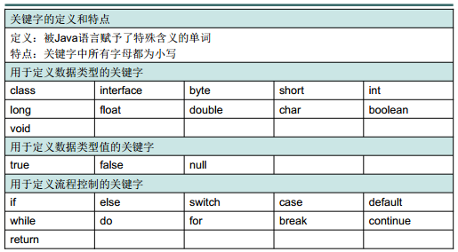
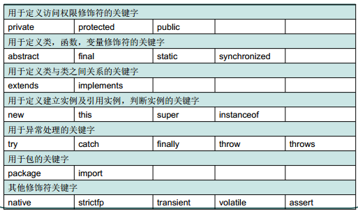
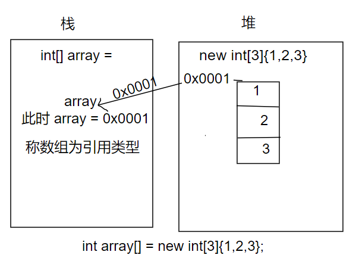
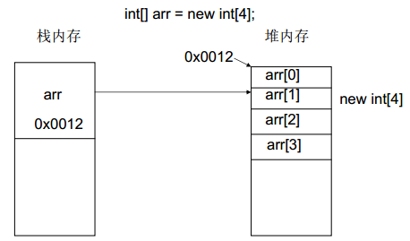

# 基础常识

软件是按照特定熟悉怒组织的计算机数据和指令的集合

常见的软件：

- 系统软件
- 应用软件

交互方式：

- 图形化界面
- 命令行方式

```shell
dir  ls
md   创建文件夹
rd   删除文件夹
cd   进入目录
cd / 进入根目录
del  删除文件
exit 退出系统
```

## Java语言概述

- J2EE 企业版
- J2SE 标准版
- J2ME 嵌入式设备

## Java的主要特性：跨平台

- 主要是因为JVM的存在

```
javac xx.java 生成字节码 xxx.class
java xxx      调用相应系统下的JVM进行编译字节码生成机器码
```

## JRE JDK

- JRE Java运行环境`(Java Runtime Environment)`
- JDK Java开发工具`（Java Development Kit）`
  - JDK包括编译工具`javac.exe)`和打包工具`（jar.exe）`

## Java环境的安装过程

```
1.配置环境变量：
	配置系统环境变量path=[jdk\bin]
	配置系统环境变量path=[jre\bin]
2.为了不因为JDK的安装位置变动而不断变更path的值，而导致了对path的误操作
	JAVA_HOME=[X:\JDK]
3.标准类库的路径配置：
	CLASSPATH=.;%JAVA_HOME%\lib\dt.jar;%JAVA_HOME%\lib\toos.jar
	.表示访问当前目录
	%xxx%：表示动态获取JAVA_HOME环境变量的值
```

## Java的第一个程序

```java
/*文件名：firstDemo.java*/
public class firstDemo {
    public static void main(String[] args){
        System.out.println("Welcome to Java World");
    }
}
```

# Java语言基础

## 关键字





## 标识符

数字字母下划线和美元符号，不能以数字开头，不能使用关键字，严格区分大小写

- 名称规范：
  - 包名：全部小写
  - 类名接口名：多单词组成，首字母大写
  - 变量名和函数名：多单词组成，第一个单词小写，第二个单词首字母大写
  - 常量名：字母大写，使用下划线连接

## 注释

- 单行注释 `//`
- 多行注释`/**/`
- 注释可以被`javadoc`所解析，生成说明文档

## 常量和变量

- `null`常量，只有一个数值，那就是`null`
- 数据类型：
  - 基本数据类型：
    - `byte` 	
    - `char`
    - `short`
    - `int`
    - `long`
    - `float`
    - `double`
    - `boolean`
  - 引用数据类型：
    - `class`
    - `interface`
    - `array[]`
- 整数默认为`int`,小数默认为`double`
- 类型转换：原则：向上提升
  - 自动类型转换
    - `System.out.println(‘a’)与System.out.println(’a’+1)  `,
    - 一个以字符形式显示，一个以整数形式显示
  - 强制类型转换

**思考**

```java
public class DataChange1{
	public static void main(String[] args){
		byte b = b + 5;
		System.out.println(b);
	}
}
/*DataChange1.java:3: 错误: 不兼容的类型: 从int转换到byte可能会有损失
                byte b = b + 5;
*/
```

分析：

```
b为byte类型，占用一个字节
5为int类型，占用4个字节
在进行b+5运算时，byte类型的数据回向int类型数据转换，导致（b+5）的值为int类型
此时的问题是：int类型的数据向byte类型的数据赋值，导致不兼容类型
修改方法：byte b = (byte)(b+5);
```

- ASCII码：
  - 48 `0`
  - 65 `A`
  - 97 `a`
- 转义字符：
  - 系统换行：
    - Linux系统使用`\n`表示换行
    - win系统使用`\r\n`表示换行
  - 关于文件路径问题：
    - 使用`\\`来表示一个斜杆
    - 或者使用`/`
  - 双引号和单引号的混用
    - 成对使用

## 运算符

一元运算符：

```java
short s = 5;
s = s +5 ; 
/*不兼容的数据类型 同上错误原因*/
```

```java
short s = 5;
s += 5;
/*制作一次赋值运算，会做自动转换*/
```

- 算数运算法

  ```
  + - * / % ++ -- +
  ```

- 赋值运算符

- 比较运算符

  ```java
  == != > < >= <= instanceof
  ```

- 逻辑运算符

  ```java
  & | ! ^ &&(短路) ||（短路） 
  ```

- 位运算符

  ```
  << >> & | ! ^ ~
  ```

- 三元运算符

  ```
  条件表达式: value1? value2
  ```

## 语句

- 判断

  ```
  if ... else ...     if...else if() ....else 
  ```

- 选择

  ```
  switch case
  ```

  - switch语句的特点：
    - 选择类型：`byte short int char`

- 循环

  ```
  while  do...while
  ```

  ```
  for(初始表达式;循环表达式；循环后的操作)
  	执行语句
  ```

  ```
  for each(int x:a)
  	xxx
  ```

- `break`

  - 跳出本层循环体

- `contiune`

  - 结束本次循环，进行下次循环

  

## 函数

### 函数定义

具有特定功能的独立的小程序

```
修饰符 返回值类型 函数名(参数类型 形式参数1，参数类型 形式参数2){
    执行语句;
    return 返回值;
}
```


### 函数的特点

- 功能封装
- 功能复用

### 函数的应用

### 函数的重载

- 允许同名函数的出现
- 重载的特点：
  - 与返回值无关
  - 只看形参列表
- 重载的好处：
  - 方便阅读，优化了程序设计

## 数组

同种数据类型的集合

从0开始编号

```
元素类型个[] 数组名 = new 元素类型[元素个数或者数组长度];
```

```java
int[] array1 = new int[]{1,2,3,4,5};
int array2[] = {1,2,3};
int array3[4] = {0};//error
array = null; //JVM的垃圾回收机制会进行定时回收
```

#### 数组类型被称之为引用类型





在内存中分配空间：

- 栈 局部变量,当数据使用完成之后，所占用的空间会自动释放
- 堆 数组和对象 通过new的对象实例都在内存中

每一个实体都有一个内存地址

实体中的变量都有默认的初始值

实体中的数据在不被使用是，会在不确定的时间内被垃圾回收机制回收释放

#### 数组常见问题

- 数组角标越界
- 空指针异常

